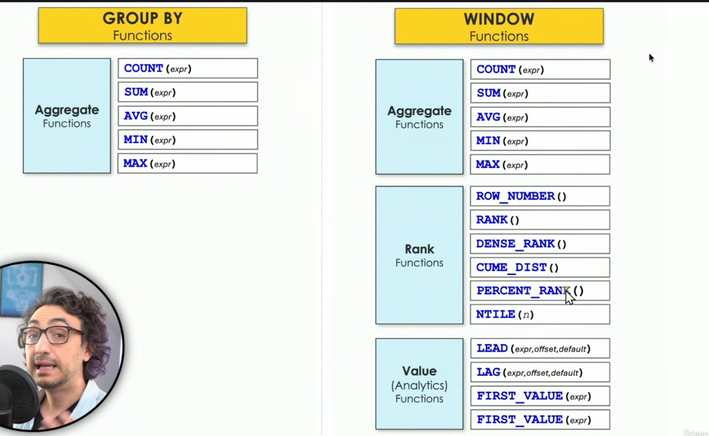
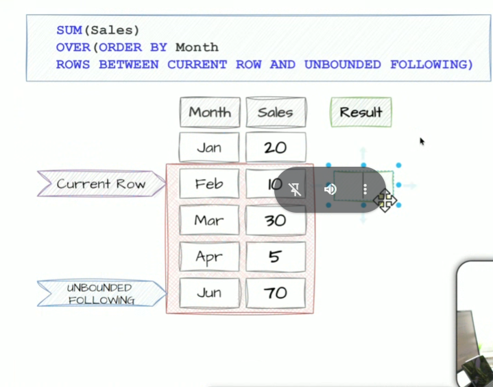
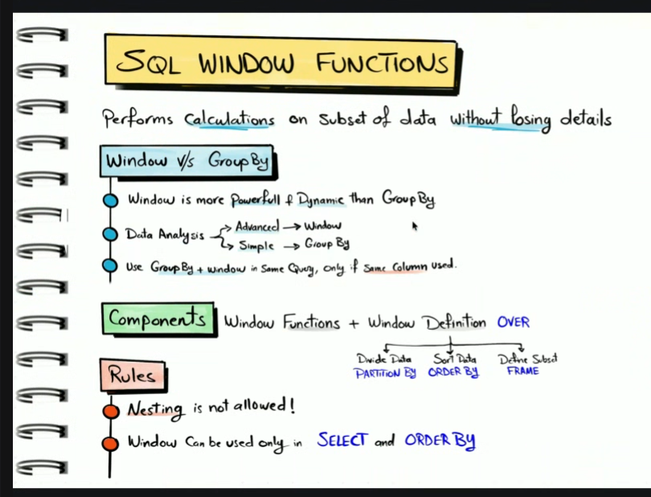

below is the list of aggregate function
1. SUM
2. count
3. MAX : max(sal
.9es)
4. min: min(sales)
5. AVG: average , syntax avg(sales)

Window functions

window function returns result for each row 
aggregate  + over()

window function classified
1. Aggregates
2. Analysis
3.

frames 

current rows to unbounded following
row 1 preceeding
between 1 preceding and 1 following

Rules
